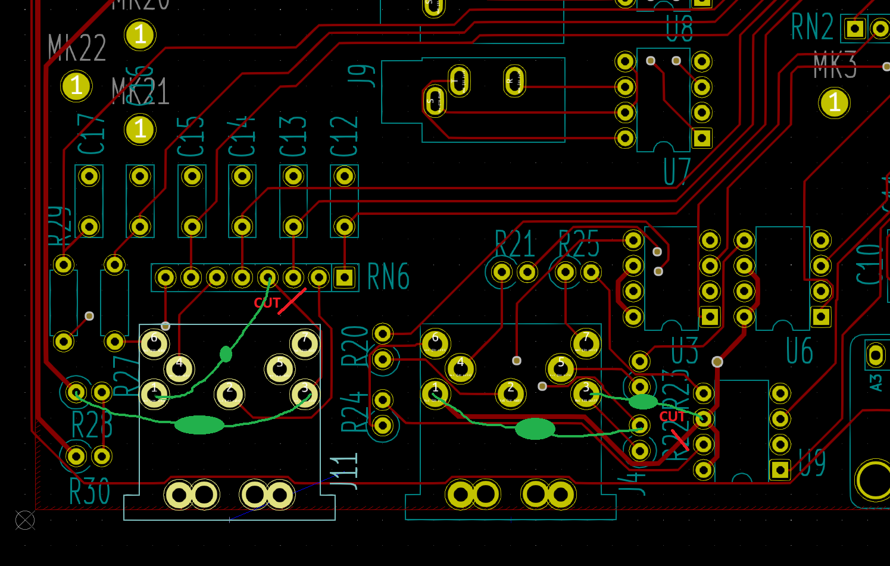

## DIN Patch

1. Remove R28
2. Remove R22
3. Cut track on top behind J11 running to RN6 pin 4
4. Cut track on top between J4 and U99 (under middle '2' of R22 label
5. Place 100R from R28.2 to J11.3
6. Place 100R from RN6.4 to J11.1
7. Place 100R from R22.2 to J4.1
8. Place 100R from U9.6 to J4.3

